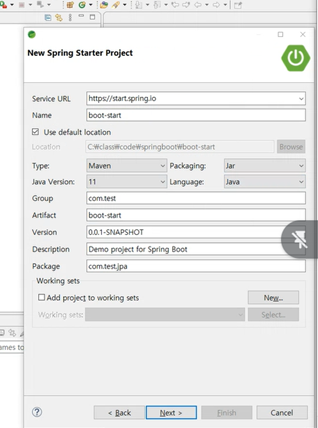

# 스프링부트 복습노트 
* 스프링 툴 
```
- STS3(기본 Spring or Spring Boot)
- STS4(Spring Boot)
```
* 설치 
  * [spring.io](https://spring.io/)
    * 해당 사이트에서 Spring Tools 4 탭 누르고 아래쪽 가면 Project Wiki 페이지에서 이동 
  * [이전버전 설치](https://github.com/spring-projects/sts4/wiki/Previous-Versions)
  * 위 사이트에서 현재 내가 쓰는 이클립스 버전과 맞는 것을 설치 
* 설치 후에는 SpringToolSuite4.ini 파일 손보기 
  * 사용하는 javaw.exe 파일 위치 넣기 
```
-vm
C:/Program Files/Java/jdk-11/bin/javaw.exe
```
* 이후에 lombok.jar 설치 필요 
  * lombok.jar이 있는 폴더에서 java -jar lombo.jar 실행해서 
  * 해당 SpringToolSuite4.exe 위치로 install 

* 스프링 부트 
  * 스프링 애플리케이션 제작 기술
  * 독립 실행 가능한 웹 애플리케이션 제작 > 톰켓이 내장되어 있음!!
  * 기존 스프링 기반 애플리케이션을 더 쉽게 빠르게 설정 가능

## boot-start 프로젝트는 maven 설정 상태
* File > new > other > new Spring Start Project 로 프로젝트 생성
* STS4점대는 레거시 프로젝트가 없다. 3점대에만 있다. 
* 아래 그림처럼 프로젝트를 생성 


<br>

* 프로젝트 생성 과정에서 dependency를 골라서 담을 수 있다. 
* 스프링 부트 버전도 선택이 가능한데 3점대는 Java17이상 써야 한다. 
* 2.7.13으로 자바 11 버전 사용
* pom.xml에서 Dependency가 처음 설정에 맞게 자동으로 추가되고 Dependency Hierarchy 탭에서 사용하는 Dependency 확인가능 
* Eclipse Marketplace에서 web developer를 검색해서 Web Developer Tools를 설치해야 jsp 사용이 가능하다. 
* src/main/resources/static 폴더에 hello.html 파일 생성하고 application.properties에 server.port=8092 이런식으로 포트번호를 입력하면 그에 맞게 서버가 열린다. 

```
Spring Boot 프로젝트 구조 
1. src/main/java
	- 이전과 동일 > 자바 소스 폴더 > 패키지 or 자바 
	- com.test.start > BootStartApplication.java
	
	- BootStartApplication.java
		- 스프링 부트의 메인 클래스 > main() 소유 역할
		- 웹 서비스 시작하고, 끝내는 역할
		- 프로젝트명 Application.java
		
2. src/main/resources
	- static
		- ★ 정적 웹 자원 
		- HTML, CSS, JavaScript, 이미지 등...
		
	- template
		- View 파일
		- views 폴더 역할
		 
	- application.properties
		- 스프링 부트 설정 파일 
		- web.xml. + root-context.xml + servlet-context.xml
		
	
★ 얘는 main과 test가 끝이다. 그래서 여기다가 넣는다.
★ 위치가 여기로 바뀐 것이다. 

3. src/test/java
	- JUnit 테스트 폴더
	 
4. JRE System Library
	- JRE 

5. Maven Dependencies 
	- Maven
	
6. src
	- 사용 잘 안함
	
7. pom.xml 
	- POM 
	
8. mvnw.cmd
	- 메이븐 실행 파일 
```

* 서버는 
  *  Ctrl + F11로 실행하거나 Boot Dashboard에서 실행
  *  메이븐 빌드 및 실행 파일 생성은 
  *  mvnw install 
     *  mvnw 있는 위치에서 커맨드창 키고 mvnw install 입력하면 메세지 겁나 뜨고 Build Success뜸
     *  target 폴더에 뭔가 이것저것이 생긴다. 
     *  boot-start-0.0.1-SNAPSHOT.jar 이거 하나 생기는데 java -jar boot-start-0.0.1-SNAPSHOT.jar 이렇게 커맨드창으로 입력하면 부트 서버가 실행된다. 

* boot-start 프로젝트는 static 폴더에 hello.html 이거 하나만 만들고 localhost:8092/hello.html 이렇게 실행하면 페이지가 나옴. 별다른 서버쪽 코드 작성 없음
* 아예 정적 자원을 실행하는 것! 

* 웹상에서 Spring.io 사이트에사 Spring Initializer로도 프로젝트 생성가능하다. 
* Gradle or Maven, Java 버전, Spring Boot 버전, Dependency 추가 등등
* 대충 프로젝트 하나 만들고 STS4열고 import로 프로젝트를 오픈한다. 
```
프로젝트를 불러올 때
import > Maven > Existing Maven Projects로 불러오고 Root Directory를 잘 선택하고 pom.xml 체크박스 체크하면 불러와짐
```
* 프로젝트 우클릭 > Spring > Add DevTools는 키자! (Dependency 추가 설정에서 넣을수 있는데 빼먹으면 여기서 추가)

## boot-jsp 내용은 다른 곳에 정리하였음
* 스프링부트의 템플릿 엔진이라는 것이 있다.
* JSP 같이 뷰단 보여주는 역할
* FreeMarker, Groovy, Thymeleaf, Mustache 등이 있다. 
* templates 폴더에다가 이와 관련 파일을 만들어서 사용해야 한다. 

## Thymeleaf 정리
* 관련 프로젝트 boot-thymeleaf